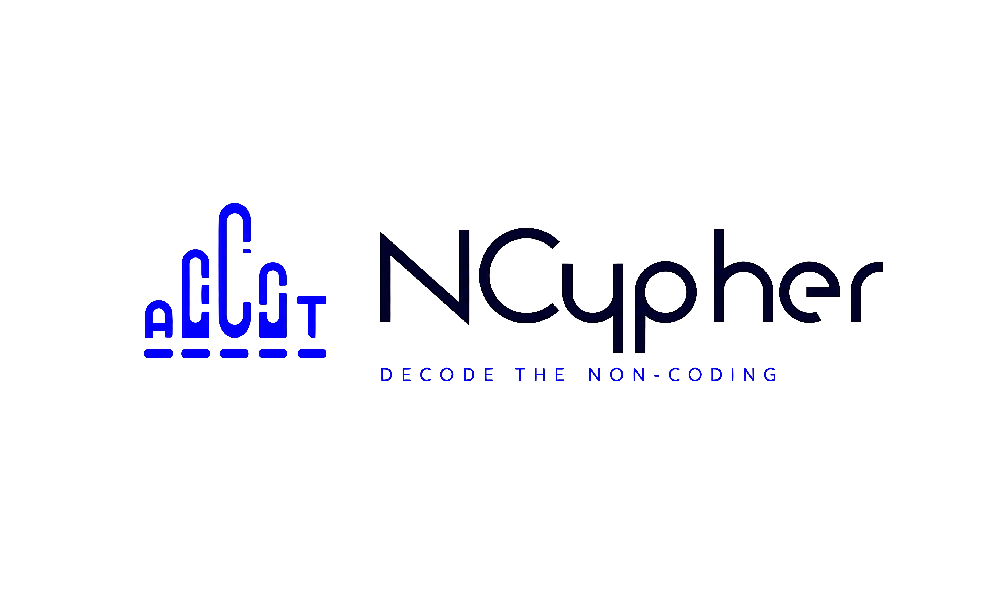
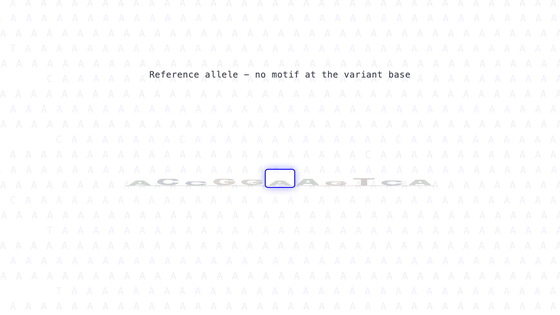
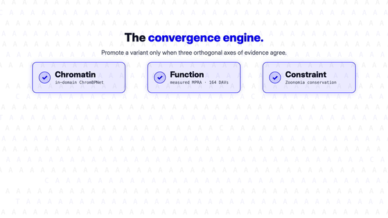
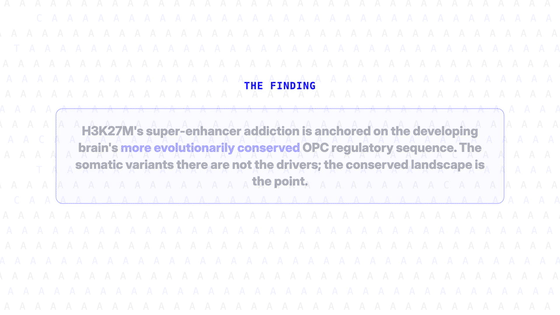
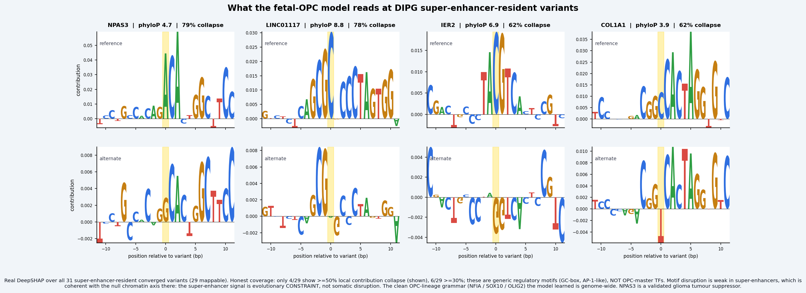
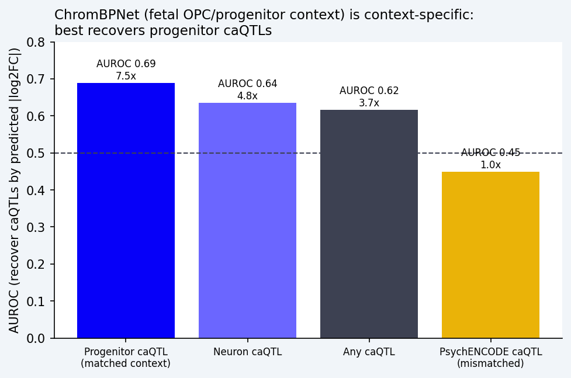

<p align="center">
  
</p>

<p align="center"><i>decode the non-coding</i></p>

<p align="center">
  A calibrated, honest, context-specific engine for triaging <b>non-coding regulatory variants</b> in paediatric<br>
  <b>diffuse midline glioma</b>, delivered as a rich MCP tool and an Agent Skill for Claude Science.
</p>

<p align="center">
  <b>Built with Claude: Life Sciences</b> &nbsp;·&nbsp; Researcher track &nbsp;·&nbsp; Apache-2.0
</p>

<p align="center">
  <a href="https://github.com/faith-ogun/ncypher/actions/workflows/reproducibility.yml"></a>
</p>

---

## What is this, in plain terms?

Most of the genome does not code for protein. The other ~98% *regulates*: it is the switches and
dials that decide which genes turn on, in which cell, and by how much. When one of those switches is
mutated the effect is real, but it is invisible to the tools built for protein-coding genes.

**Diffuse midline glioma (DMG)** is a paediatric brain cancer defined almost entirely by this kind of
regulatory dysregulation. A single histone mutation, H3 K27M, rewrites the cell's enhancer landscape.
Its protein-coding genome is quiet; its non-coding genome had never been read systematically.

NCypher reads it. For any non-coding variant `chr-pos-ref-alt` it asks one question in three
independent ways:

> **Does this variant change a real regulatory element in the cell type where DMG begins, and if so,
> which motif and which base does it break?**

It couples a regulatory-activity **score**, the **mechanism** (the motif and the exact base), and an
honest **confidence** flag into a single agent call, and promotes a variant only when independent
lines of evidence agree. It is **not** a bigger variant-effect predictor. It is the coupling and
triage layer that tells a researcher which variants to validate first, and why.

---

## Why it matters

| | |
|---|---|
| New cases each year (US) | **about 300 children** |
| Median age at diagnosis | **6 to 7 years** |
| Median survival | **about 11 months** |
| Die within 2 years | **about 90%** |
| Reach 5 years | **about 2%** |
| Rank among childhood brain-tumour deaths | **the leading cause** |
| First approved drug | **August 2025 (dordaviprone), and not a cure** |

DMG (the H3 K27M diffuse midline glioma that includes DIPG) is **almost uniformly fatal**.
Radiotherapy buys months. Decades of clinical trials have not moved the median survival, and the
first systemic drug arrived only in August 2025 without curing anyone. Every figure above is sourced
to a primary or authoritative reference (Hoffman et al., *J Clin Oncol* 2018, PMID 29746225, is the
core survival citation). Any tool that helps a field spend its scarce validation effort on the right
targets, sooner, is acting where months matter.

---

## See the key ideas in motion

**The mechanism, made visible.** At a single base the alternate allele builds a GGAA ETS motif; the
ref-vs-alt DeepSHAP saliency shows the model reading the exact letter that changes, not just returning
a number.

<p align="center"></p>

**A variant is promoted only when three orthogonal lines of evidence agree**: chromatin accessibility,
measured reporter function, and evolutionary constraint. Agreement is stringent by design; the
disagreements are informative too.

<p align="center"></p>

**The finding, stated honestly.** The super-enhancer addiction that drives DMG is anchored on the
developing brain's most conserved regulatory sequence, not on somatic mutation.

<p align="center"></p>

---

## The finding

The first read of DMG's somatic non-coding variation against the enhancers the H3 K27M oncohistone
builds, in the fetal-OPC context. Honest, and deliberately two-sided.

**The null, stated up front.** Somatic non-coding variants do **not** drive the DIPG super-enhancers,
the BET / CDK7 addiction that defines the disease. Inside versus outside the super-enhancers,
convergence is flat (1.6% vs 1.5%, Fisher p=0.4) and chromatin high-impact is flat (7.4% vs 6.8%,
p=0.2). That is exactly what an epigenetic disease predicts, and it kills the naive "the mutations
create the addiction" story before it starts.

**The signal.** But the super-enhancers are anchored on more evolutionarily conserved OPC regulatory
sequence: phyloP-constrained 17.0% vs 14.0% (Fisher p=6e-4), median phyloP 0.28 vs 0.19 (Mann-Whitney
p=3e-3). It survives both a class-matched and a class x GC-decile-matched permutation
(**both p<0.001**), so it is not gene proximity or GC content; the bootstrap median-phyloP difference
is **+0.094, 95% CI [+0.029, +0.162]** (excludes zero); and it is genic-driven, null in intergenic
regions.

So H3 K27M's druggable super-enhancer addiction sits on the developing brain's conserved OPC
regulatory sequence: the conserved landscape is the signal, not somatic disruption. The lead
candidate is **NPAS3**, a validated glioma tumour suppressor resident in a super-enhancer (phyloP
4.7). The result fuses three home-field resources at once: **Zoonomia** constraint, the **Nagaraja**
DIPG super-enhancers, and the **Corces** fetal-OPC model. Honest bound: a modest effect,
hypothesis-generating, not a driver claim.

<p align="center"></p>

*What the fetal-OPC model reads at the 31 super-enhancer-resident converged variants (29 mappable,
real DeepSHAP). Honestly, only 4 of 29 show a strong (>=50%) local contribution collapse and 6 of 29
reach 30%, and those are generic regulatory motifs (GC-box, AP-1-like), not OPC-master TFs. That
weakness is coherent with the chromatin-axis null: the super-enhancer signal is evolutionary
constraint, not somatic motif disruption. NPAS3 is the standout, a clear model readout on a validated
glioma tumour suppressor.*

---

## Validated, honestly

NCypher's chromatin axis is validated on its **native ground truth, caQTLs** (allelic
chromatin-accessibility QTLs), not on a modality it was never built for.

- In its **matched fetal-OPC / progenitor context**, ChromBPNet recovers progenitor caQTLs at
  **AUROC 0.689** (95% CI [0.592, 0.777]), **7.5x** the base rate. It is weaker for neuron caQTLs
  (0.64), weaker again for any caQTL (0.62), and null for a mismatched PsychENCODE set (0.45). The
  context-specificity gap (progenitor minus mismatched) is **+0.240, 95% CI [+0.081, +0.394]**, which
  excludes zero. This quantitatively validates the "right cell context matters" claim: the model is
  not generically good, it is good *in its matched context*.
- **The honest negative.** It does **not** recover the 164 developing-cortex MPRA
  differential-activity variants (AUPRC 0.018, chance). This is expected, not a bug: ChromBPNet
  predicts chromatin **accessibility**; the MPRA measures reporter **activity**. They are different
  modalities, which is why Pollard trained a separate CNN-BiLSTM for the MPRA. MPRA is the wrong
  ground truth for a chromatin model, and the three axes are orthogonal by design.

<p align="center"></p>

*The chromatin engine is context-specific: it best recovers progenitor caQTLs in its matched
fetal-OPC context (7.5x, AUROC 0.69) and is null for a mismatched set.*

---

## How it works

Three orthogonal axes for a variant `chr-pos-ref-alt`:

| Axis | Evidence | Source |
|---|---|---|
| **Chromatin** | predicted accessibility change | Corces / Marderstein fetal-OPC **ChromBPNet** (`trevino_2021.c15`), DMG's cell of origin, no training |
| **Constraint** | per-base evolutionary constraint | **Zoonomia phyloP** (241 mammals), streamed remotely |
| **Function** | measured allelic effect, where available | caQTL / lentiMPRA |

A **convergence engine** promotes a variant only when the axes agree, surfaces the informative
disagreements, and emits a **go / no-go memo**: validate X first, the decisive experiment to run, and
the kill criterion. Mechanism is a ref-vs-alt **DeepSHAP saliency logo** where the disrupted motif is
visible at the exact base (integrated-gradient saliency with the Majdandzic correction for one-hot
DNA). Because an *agent*, not a human, is calling this, every claim carries an explicit honesty flag
and an out-of-domain guardrail.

---

## Delivery, four surfaces

| Path | What it is |
|---|---|
| [`mcp/`](mcp/README.md) | a rich **FastMCP** server (`score_variant`, `top_candidates`, `cohort_summary`) that returns the saliency image, the convergence JSON, the memo, the confidence tier and the provenance in one call, never a bare text blob |
| [`skill/`](skill/SKILL.md) | the **`ncypher-triage`** Agent Skill: score, converge, mechanism, an independent skeptic check, then the memo |
| [`dashboard/`](dashboard/README.md) | a polished **React** dashboard: variant triage, the finding, the validation |
| [`modal/`](modal/README.md) | ChromBPNet inference + DeepSHAP on **Modal**, parallel fan-out for cohort scale |

The hero demo runs live inside Claude Science: one sentence in, a plan with a confidence score,
subagents call the NCypher Skill and MCP, the rich artifacts render in-session, a *separate* reviewer
agent re-derives the headline number, and out comes the go / no-go memo.

---

## How it evolved

NCypher was wrestled into shape, not one-shot. The two moments that matter most: we **killed our own
headline** the day it failed honestly, and the flagship result is a **two-sided null**.

| Version | What changed |
|---|---|
| **v0.1** | Concept + scaffold: the triage framing, and the decision to build *on* the Corces / Pollard / Zoonomia stack rather than train yet another model. |
| **v0.2** | The engine, end to end: fetal-OPC ChromBPNet on Modal, Zoonomia phyloP streamed live, convergence + GO / HOLD / NO-GO memo. The TERT positive control passes; 15 unit tests. |
| **v0.3** | The discovery reframe: from "a tool" to "a discovery engine", with a multi-subagent literature sweep to find where the engine had never been run. |
| **v0.4** | The cohort + functional-first sweep: OpenPedCan v15 (1.1M somatic non-coding SNVs), an impact threshold calibrated to a cohort background (p99 = 0.162), 10,869 OPC-regulatory variants scored on Modal. An honest negative: 164 converged, 0 recurrent, 0 in canonical drivers. |
| **v0.5** | **The validation pivot, where we killed our own headline.** We tested the chromatin model against the Pollard MPRA expecting a win; it scored at chance (AUPRC 0.018). Rather than bury it we diagnosed why (accessibility vs activity), retired the claim, and found the correct ground truth, caQTLs, where it works and is context-specific (7.5x), later hardened with 1,000x bootstrap CIs. |
| **v0.6** | The reckoning: a validated method but no finding yet. A hard reset to mine the data properly surfaced a constraint-driven neurodevelopmental convergence and NPAS3. |
| **v0.7** | **The flagship finding.** The DIPG super-enhancers (Nagaraja 2017, lifted hg19 to hg38, verified on TERT), a mutation-rate- and GC-matched permutation background, and bootstrap CIs. The honest, two-sided result above. |
| **v0.8** | The delivery layer: the rich FastMCP server, the `ncypher-triage` Skill with an independent skeptic step, the React dashboard, and the explainer videos. |
| **v0.9** | Brand + rigour hardening: the Onkydra-aligned rebrand, a copy sweep to kill every overclaim, and an internal audit against the Pollard / Whalen bar that made the project *more* honest, and added the reproducibility CI gate. |
| **v1.0** | Submission: the reproducible notebook, the 100 to 200 word summary, the <=3-minute demo video, and the public Apache-2.0 repo. |

---

## Reproduce

```bash
python3.10 -m venv .venv && . .venv/bin/activate && pip install -r requirements.txt
PYTHONPATH=src python -m pytest tests/ -q                     # engine unit tests
PYTHONPATH=src python scripts/validate_caqtl.py              # the caQTL validation
PYTHONPATH=src python scripts/bootstrap_caqtl.py             # bootstrap CIs + context-specificity
PYTHONPATH=src python scripts/k27m_se_analysis.py            # the K27M super-enhancer finding
PYTHONPATH=src python scripts/k27m_se_constraint_control.py  # the confound controls
```

ChromBPNet scoring and DeepSHAP run on Modal (see [`modal/README.md`](modal/README.md)); large data
(hg38, the OpenPedCan MAF, the MPRA tables, the models) is fetched, not committed. A GitHub Actions
**reproducibility gate** re-runs the validation on every push and has Claude check that the headline
**AUROC 0.69 / 7.5x** still reproduces and still matches this README, so the "reviewer verifies the
number" beat is a permanent public artifact, not a claim.

---

## Layout

```
src/nc_score/   variants, genome, constraint, scoring, converge, saliency, viz, cohort, validate, data
modal/          ChromBPNet inference + DeepSHAP (Modal, parallel fan-out)
mcp/  skill/    the FastMCP server + the ncypher-triage Agent Skill (the delivery layer)
dashboard/      the React product surface
scripts/        validate_caqtl, bootstrap_caqtl, k27m_se_analysis, k27m_se_constraint_control, ...
tests/          engine unit tests
assets/         README media (logo, motion GIFs, result figures)
```

---

## Provenance

| Resource | Reference |
|---|---|
| Engine (fetal-OPC ChromBPNet, `trevino_2021.c15`) | Marderstein, Kundu et al., *Nature Genetics* 2026 (Corces / Gladstone + Stanford), Synapse `syn64693551` |
| ChromBPNet | Pampari, Kundaje et al. |
| Constraint | Zoonomia `cactus241way` phyloP (241 mammals) |
| Function (caQTLs + 164 DAVs) | Deng, Whalen ... Pollard, *Science* 2024 |
| DIPG super-enhancers | Nagaraja et al., *Cancer Cell* 2017 |
| DMG cohort | OpenPedCan v15 |
| NPAS3 (glioma tumour suppressor) | Moreira et al., 2011 |

---

## Documentation

| File | What it is |
|---|---|
| [`skill/SKILL.md`](skill/SKILL.md) | the `ncypher-triage` workflow the Agent Skill runs |
| [`skill/example_run.md`](skill/example_run.md) | a worked triage, end to end |
| [`skill/references/guardrails.md`](skill/references/guardrails.md) | the honesty guardrails carried on every claim |
| [`mcp/README.md`](mcp/README.md) | the MCP server and its tools |
| [`modal/README.md`](modal/README.md) | ChromBPNet scoring on Modal, with the model accessions |
| [`dashboard/README.md`](dashboard/README.md) | the React dashboard |

---

*The arc: NCypher (decode the non-coding) is step one; Onkydra (the agentic oncology lab) is step two.
Built by Faith Ogundimu, computational cancer genomics, RCSI University of Medicine and Health
Sciences.*
